So I've been talking with/at @avehtari about the Birthday problem and we think this
might be of general interest.

This will be about three things:

* a workflow to find a reasonable and computationally efficient model and configuration,
* a simple visualization to assess the convergence of approximate Gaussian process,
* automatically tuning both the fidelity of the approximation and the parametrization.

**I want to stress that what follows need not be orthogonal to what @avehtari describes in his
write-up, but may rather complement his quick prototyping.** Think of this less
as a way to quickly iterate on prototypes, but to figure out potential obstructions
to efficient exploration by revisiting the sequence of prototypes.

First, the model and data:

# The Birthday problem

The so called Birthday problem models the registered births in the USA from
1969-1988 using a [Gaussian Process](https://en.wikipedia.org/wiki/Gaussian_process) (GP).
A visualization of it can be seen on the cover of [the third edition of Bayesian Data Analysis](http://www.stat.columbia.edu/~gelman/book/) (BDA3), which also includes a discussion of
a sequence of statistical models used in analyzing the data (BDA3, chapter 21). There
also exists a [demo](https://research.cs.aalto.fi/pml/software/gpstuff/demo_births.shtml)
using [GPstuff](https://research.cs.aalto.fi/pml/software/gpstuff/),
a more recent [write-up/notebook](https://avehtari.github.io/casestudies/Birthdays/birthdays.html) by @avehtari
using Practical Hilbert space approximate Bayesian Gaussian processes (HSGP) for probabilistic programming  ([arxiv](https://arxiv.org/abs/2004.11408), [discourse thread](https://discourse.mc-stan.org/t/practical-hilbert-space-approximate-bayesian-gaussian-processes-for-probabilistic-programming/14633))
and I think there are also some talks on the problem by @andrewgelman online.

## The approximation

The computational cost of *every* log density evaluation
scales *cubically* with the number of observations $n$ for exact GPs, which is always bad news.

The HSGP on the other hand scales linearly in the number of observations $n$ and
in the number of basis functions $m$ (the paper and the discourse thread claim
that precomputation cost scales as $m^2n$, but I do not see why this would be so).

Skipping some details, the HSGP works by representing both the covariance function $k(x,x')$ and
the "states" $f(x)$ as a (truncated) infinite weighted sum of some
covariance-function-dependent basis functions $\psi_j(x)$.
For the implementation, all that is needed is a (precomputable) $n \times m$ matrix
$\Psi_{ij} = \psi_j(x_i)$ where $\psi_j$ is the $j$-th basis function and $x_i$
is the position of the $i$-th observation, and for each log density evaluation
only one matrix-vector product is needed.

# Computational inefficiencies and non-convergence of the GP-approximation

Quoting @avehtari talking about the [final models](https://avehtari.github.io/casestudies/Birthdays/birthdays.html#Model_8:_long_term_smooth_+_seasonal_+_weekday_with_time_dependent_magnitude_+_day_of_year_+_special) in his above linked write-up:

> In the end we also run with higher adapt_delta [(.95)] to reduce the probability of divergences, higher maximum treedepth [(15)] to ensure higher effective sample size per iteration (ESS per second doesn’t necessarily improve), and run much longer chains, but didn’t see practical differences in plots or LOO-CV values. As running these longer chains can take hours they are not run as part of this notebook.

I do not believe this should be necessary (for most of the discussed models) and
run-time should be in the order of minutes and preferably not much longer than the
time spent plotting (if you plot a lot of things).

More importantly though, although @avehtari explicitly writes

> We also use quite small number of basis functions to make the code run faster, and only later examine more carefully whether the number of basis function is sufficient compared to the posterior of the length scale (see, Riutort-Mayol et al., 2020).

this does not happen (at least not in the notebook), and if the model already
takes hours to run with few basis functions, iteratively determining the "ideal"
number of basis functions will potentially take several hours more.

As it turns out, the number of basis functions used throughout the notebook
appears to be insufficient to capture the full behavior of the "exact" posterior(s),
meaning the posterior that we had obtained had we not used an approximation of the
GPs but the exact GPs.

# At a glance - sequence of original models and their potential problems

Here I just list the models from @avehtari's notebook and the problems I think they might have,
which may or may not carry over to later models. **It should be stressed that the
point of the original notebook was not to present a sequence of perfect models, but
a sequence of quick prototypes that may ultimately lead to a good/acceptable model**.

* [`model1` (slow)](https://avehtari.github.io/casestudies/Birthdays/birthdays.html#Model_1:_Slow_trend):
Only models the slow trend over the 20 years in the data. There appear to be five issues:
  * The GP is able to model an intercept on its own, leading to a mild non-identifiability.
  * The exact "slow GP" is not actually very slow.
  * The number of basis functions is not sufficient to accurately represent the exact GP.
  * Fitting the model on some first part of the data does not appear to give good predictions
for the second part of the data.
* [`model2` (slow+seasonal)](https://avehtari.github.io/casestudies/Birthdays/birthdays.html#Model_2:_Slow_trend_+_yearly_seasonal_trend):
Models the slow trend and a (constant) seasonal effect.
The only potential additional issue is a numerical one:
  * The [implementation of the spectral density](https://github.com/avehtari/casestudies/blob/master/Birthdays/gpbasisfun_functions.stan) does not appear to work for small lengthscales.
  * Does not appear to remove the issues from `model1`.
* [`model3` (slow+seasonal+day of week)](https://avehtari.github.io/casestudies/Birthdays/birthdays.html#Model_3:_Slow_trend_+_yearly_seasonal_trend_+_day_of_week):
In addition to `model2`, models a (constant) weekday effect.
  * Appears to add an additional potentially problematic intercept term.
  * Does not appear to remove the issues from `model2`.
* [`model4` (slow+seasonal+varying day of week)](https://avehtari.github.io/casestudies/Birthdays/birthdays.html#Model_4:_long_term_smooth_+_seasonal_+_weekday_with_increasing_magnitude):
In addition to `model3`, models the weekday effect as varying.
  * Does not appear to remove the issues from `model3`.

# Discussion of potential problems

We will make rather excessive use of animated figures (GIFs), visualizing the evolution
of the fit and the predictions as we fit more data to the models.
Looping has been disabled, to replay reload the figure.

**Important caveat: all of these plots are generated during warm-up, i.e. "although this result can be useful in a quick workflow, the result should not be used as the final result".**
(shamelessly copying @avehtari's disclaimer).

Throughout

* a black horizontal line denotes the mean of the remaining data,
* the moving black vertical line denotes the boundary of the fitted data,
* a red wiggly line denotes the mean of the (GP) states,
* green or orange wiggly lines denote one realization of the GP (is this the right word?),
with green meaning we think our approximation has converged and orange meaning
we do not think so.

All length-scales are in days, all magnitudes are in units of standard deviations
of the data (`log(births)`). The transformed y-data range from roughly -3 to +2.

All models use an adaptive centered/non-centered parametrization.

## Model 1 (slow)

First, a visualization of the fit of the (rebuilt) [first model](https://github.com/avehtari/casestudies/blob/master/Birthdays/gpbf1.stan)
with the original configuration, i.e. 10 basis functions and
```stan
  intercept ~ normal(0, 1);
  beta_f1 ~ normal(0, 1);
  lengthscale_f1 ~ lognormal(log(700), 1); //in days
  sigma_f1 ~ normal(0, .5);
  sigma ~ normal(0, .5);
```

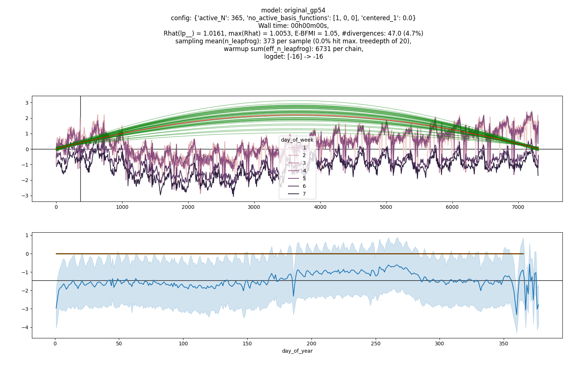

While the end result looks reasonable enough, a routine workflow unearths some issues
that may or may not become problems down the line. First, **routinely visualizing
the parameters-pairs with the highest correlations** reveals some weird dependence
between the intercept term and the weight of the first basis function:


There are strong correlations between all basis functions and also some weird
bowtie-like dependence between the first basis function and the intercept term.

The reason for the dependence between the intercept and the first basis function
is that not all basis functions have zero mean. To remove this dependence
we have two options. Either we remove the intercept term, or we make the basis functions
have zero mean. Both options work **and lower the average number of leapfrog steps
required**. The first model needs 160k total warmup leapfrog steps per chain and
246 leapfrog steps per sampling iteration, while the other two models need
98k/92k and 60/24 respectively. Neither of the models removes the correlations
between the basis functions, which hints at the potential need for a dense metric
for efficient exploration.

#### Zero mean


#### No intercept


The above plots were generated with the original settings, i.e. using only
10 basis functions. Curious to see what happens, we allow the original model to add
basis functions until it thinks it has converged to the exact GP or until
it hits the generous limit of 256 basis functions. What happens next may surprise you:

#### Full basis fit

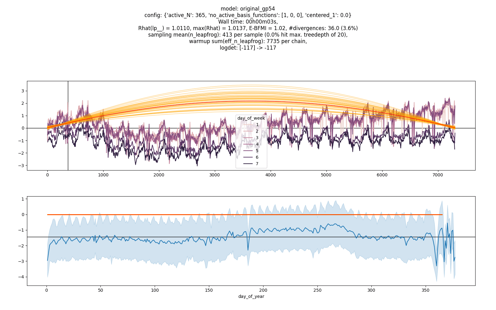

This looks very different from the plot with only 10 basis functions and
the number of needed leapfrog steps is suddenly much lower!

What happened? By restricting the number of basis functions to 10,
we essentially modified the prior on the length-scale of the GP.
Our approximation is simply not able to represent wiggly functions, even though
they are compatible with both the prior and the posterior. Indeed, visualizing
the prior predictive distribution of the first model with the "full" set of basis
functions reveals that our supposedly slow GP is not slow at all:

#### Full basis prior

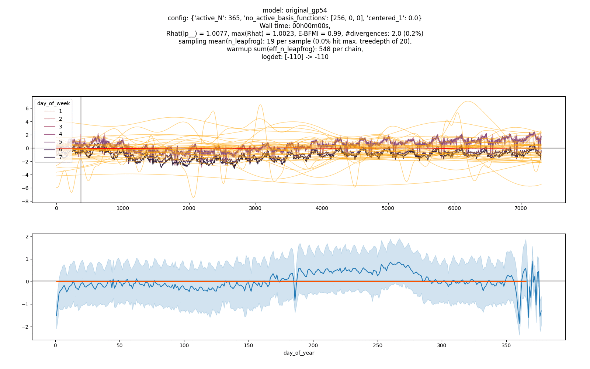

The ability of our slow GP to capture fast oscillations may or may not turn out
to be a problem later on. Bear in mind that currently the slow GP is the only thing
feeling the full weight of the likelihood, which is then able to push the parameters
into a priori "unreasonable" values. The more important question also for later is
**how to find out whether the chosen number of basis functions is sufficient?**

Potentially, one could look at the posterior of the length-scale, dig into the
arxiv paper and find out that they propose to compute the
total variation difference between the exact and approximate covariance functions
and be satisfied if this is below some predefined threshold. The only problem is
that you will have to compute an infinite integral which depends on the length-scale
and the GP standard deviation, which seems rather complicated.

A simpler way to find out about issues with your approximation appears to be the following:

* Given an intermediate fit with $n_1$ basis functions, try to resample
(using [Importance sampling](https://en.wikipedia.org/wiki/Importance_sampling))
from the posterior due to an approximation with $n_2=2*n_1$ basis functions,
with the weights of the new basis functions drawn from their "prior" distribution.
If you can do this (Neff > some threshold) do not refine, else add basis functions.
* Plot the
"marginal basis function weights conditional only on the length-scale and GP standard deviation".
If this distribution is not centered
very closely around zero for your last basis function, you need more basis functions.

Of course, to be able to do this you have to be able to add basis functions
during warm-up, which you cannot (but I can).

In fact, all plots have been and will be generated using the first strategy
which can easily be automated. The second strategy serves as reassurance for the user.
As a demonstration that this will indeed flag an insufficient number of basis functions,
observe the evolution of the "marginal basis function weights" for the first model
with a maximum of 10 basis functions:

### Reduced basis approximation quality

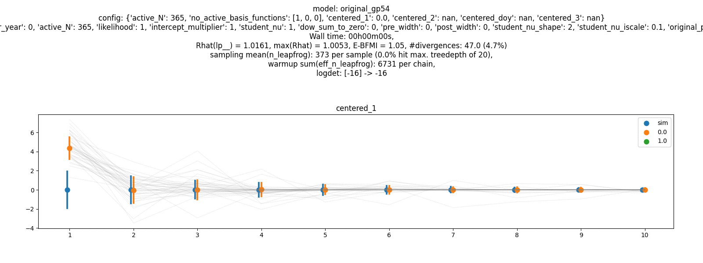

The blue vertical lines represent the
"marginal basis function weights conditional only on the length-scale and GP standard deviation"
while the green/orange vertical lines represent the marginal basis function weights conditional
on the data. Grey lines represent individual draws.

What do we mean with
"marginal basis function weights conditional only on the length-scale and GP standard deviation"?
For each (intermediate) posterior draw,
take the length-scales and the GP standard deviations,
simulate basis functions weights according to the GP prior with these hyperparameters
and then pool these simulations.
This will tell you how much weight could/should be allocated to each of the basis functions.

Why should this work? The standard deviation of these distributions should be
monotonically decreasing. Once the standard deviation of one basis functions goes
below some threshold, the standard deviations of the subsequent basis functions will be
lower as well, as will their potential contributions to the values $f(x)$ of the GP.

The plot clearly shows that for the original model, 10 basis functions are not sufficient,
as the final distribution is still quite wide. Before we show the same plot for the
model with 256 basis functions, compare the above plot with the plots for the models
with zero-mean basis functions or without an intercept:

#### Zero mean

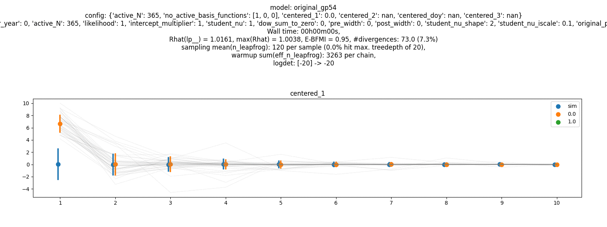

#### No intercept

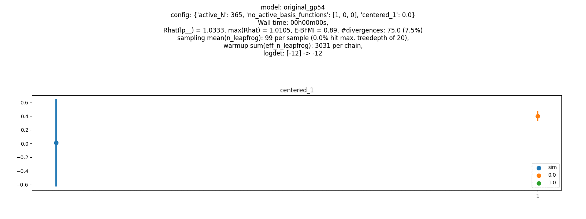

The weights for all basis functions appear to be very similar and well
identified, except for the weights for the first one, which remains wide
for the model with the zero-mean basis functions.

And finally, the same plot for the model with 256 maximal basis functions:

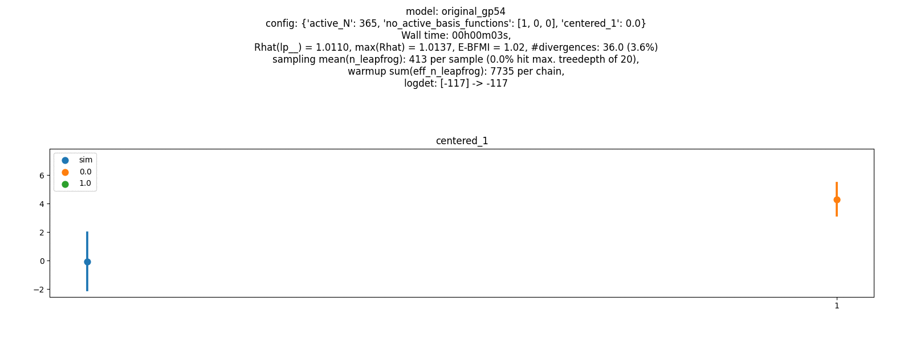

As one can see, many more than the first 10 basis functions have an appreciable
impact on the GP.

### A short intermediate summary

So far, by

* routinely monitoring the highest correlation parameter pairs,
* routinely monitoring and adapting the approximation quality and
* routinely monitoring and adapting the centeredness of the parametrization (not discussed)

we have revealed that the following alternatives may (or may not) allow for
more efficient or more faithful posterior exploration also for later models:

* Removing the intercept term,
* making the basis functions have zero mean,
* making the final parametrization for the first GP centered,
* adding more basis functions to the slow GP.

These changes may or may not help with later models. The behavior of the slow
part of the model may or may not be qualitatively very different if it
"does not feel the full weight of the likelihood".

The remaining open question is whether it is "acceptable" that the slow GP
is able to model fast trends. If what we actually want is a GP that is accurately
modeled by only 10 basis functions, then (I believe) our priors should reflect that!
It may then still be acceptable that it gets pulled into a more wiggly regime by a very
strong likelihood, but that is then a different issue.

If a priori we want the 10th basis functions to have roughly 1/100th of the weight
of the first basis function, we have to ([let WolframAlpha](https://www.wolframalpha.com/input/?i=Solve%5Bsqrt%5Bx*exp%28-1.%2F2*%2810*x*pi%2F2%29%5E2%29%5D%2Fsqrt%5Bx*exp%28-1%2F2*%281*x*pi%2F2%29%5E2%29%5D%3D%3D1e-2%2Cx%5D)) solve a simple nonlinear equation
for the length-scale. Doing this we can construct a prior for the length-scale that
puts little mass onto small length-scales, corresponding to wiggly functions.

Fitting the original model with this modified prior yields a fit that is more aligned
with our expectations even with 256 allowed basis functions:


Looking at the plot of the basis function weights reveals that the approximation
appears to have converged:
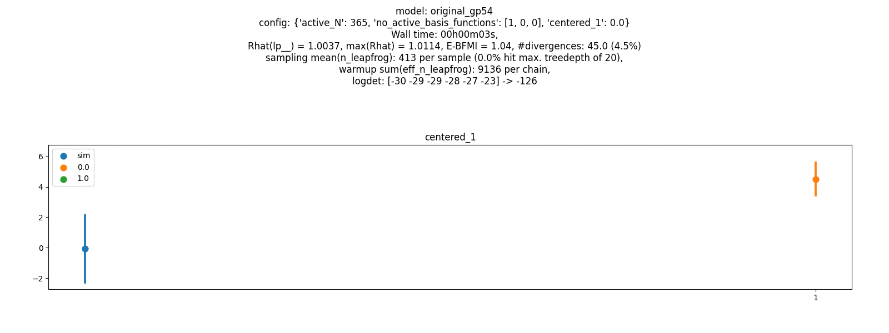

This model still has a non-identified weight of the first basis function,
because we did not apply any of the fixes for that.

While the final fit of this model (and of this model with any of the fixes) looks
fine, intermediate fits look very awkward with the predicted states sometimes surpassing
+6 standard deviations while the data range stays inside [-3,+2]. Looking
at the prior predictive plots makes it appear as if the prior on the standard deviation
of the slow GP is allows somewhat large values:
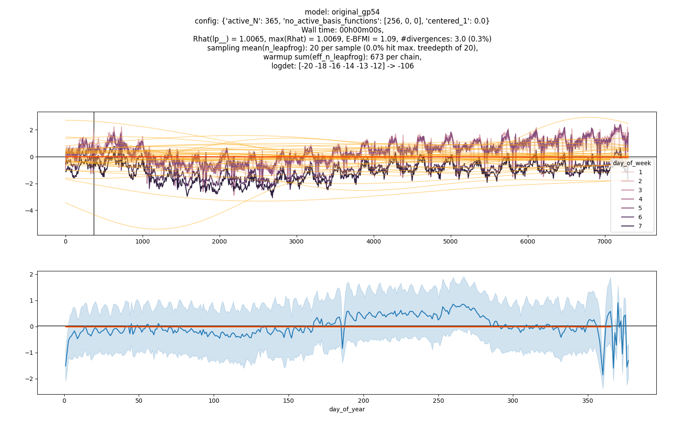

Lowering the standard deviation of the GP by a factor of 4 yields more reasonable
if slightly too flat prior predictive checks:
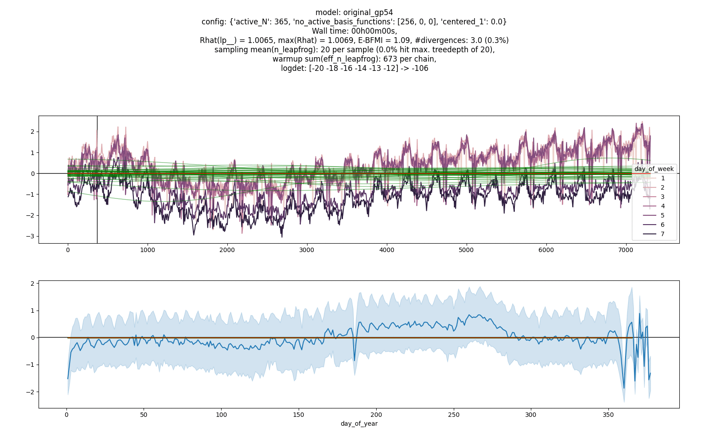

The intermediate predictive performance (in the eye norm) is also much better,
which also reflects in lower intermediate needed number of leapfrog steps, as the
posterior of the previous datasets are closer to the posterior of the next datasets:
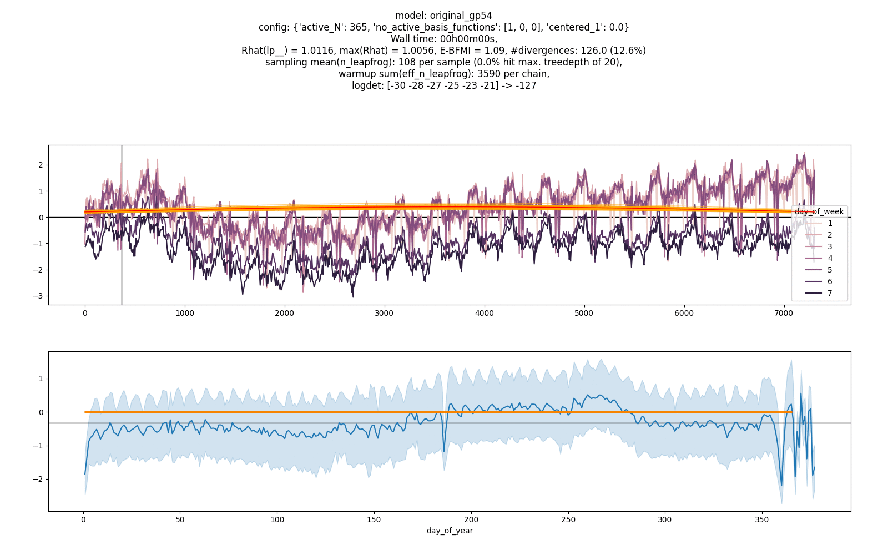

#### Are we double-dipping?

Maybe? You tell me. The intermediate predictive performance of the first model
is clearly dependent on the prior. If I had the necessary expertise with GPs,
I guess I could have chosen better priors in the first place without first
conditioning on the data. Lacking any intuition for GPs in general or HSGPs in
particular, I'm guessing some experimentation should be allowed.

## Model 2 (slow+seasonal)

So far, much more time has been spent and more ink has been spilled
on the first model than in the original notebook.

Has all of this been worth it? Maybe, maybe not. There lies danger in premature
optimization, but there also lies danger in not spotting and eliminating potential
problems as soon as possible.

Let's see how the [second model](https://github.com/avehtari/casestudies/blob/master/Birthdays/gpbf2.stan) performs with the original configuration, i.e. with
10 basis functions for the slow trend, 2x20 basis functions for the seasonal effect
and the following priors:
```stan
  intercept ~ normal(0, 1);
  beta_f1 ~ normal(0, 1);
  beta_f2 ~ normal(0, 1);
  lengthscale_f1 ~ lognormal(log(700), 1); //in days
  lengthscale_f2 ~ normal(0, .1); //in years
  sigma_f1 ~ normal(0, 1);
  sigma_f2 ~ normal(0, 1);
  sigma ~ normal(0, .5);
```


While the end result again looks good and
the seasonal trend also looks good throughout,
the intermediate predictive performance of the slow GP is horrible and
the number of leapfrog steps stays high.

In addition, while the approximation of the seasonal GP appears to have converged nicely,
the slow GP approximation again has not and the first basis function of the slow GP
is again not identified due that thing with the intercept.

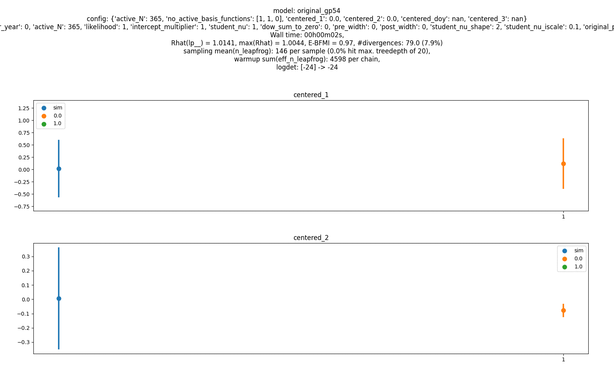

Removing the intercept again leads to identification of the weight of the first slow
basis function and lowers the number of needed leapfrog steps. The intermediate
predictive performance still does not look great and the slow GP also does not converge,
so we add the fixes from before (no intercept, GP1(larger length-scale, lower SD)).

This leads to great intermediate predictive performance, while leading to the same
final result in shorter time and with much fewer leapfrog steps:

### Model 2: No intercept, GP1(larger length-scale, lower SD)


Both approximate GPs appear to have converged:

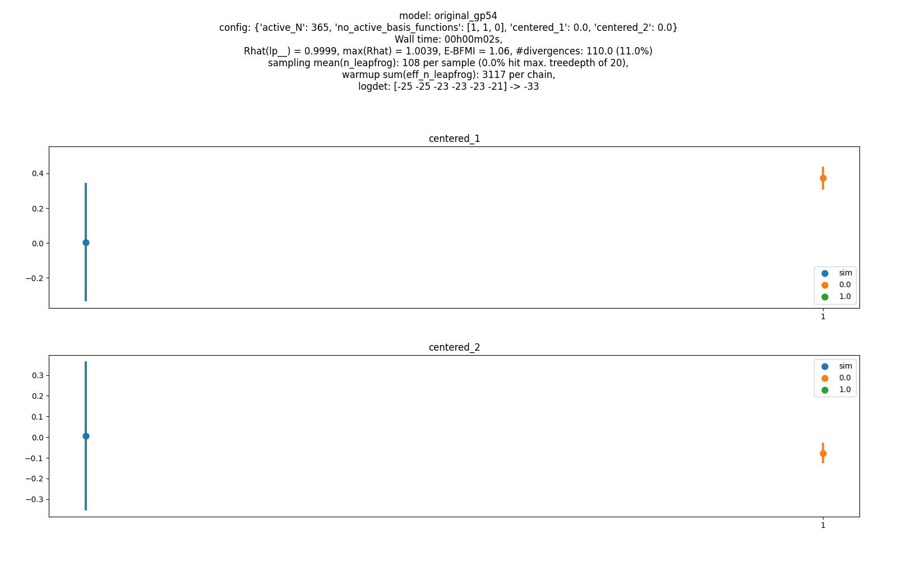

The basis function weights for the slow GP are not identified as well as before.
This may or may not indicate problems. Let's check out the correlations:


This appears to reveal the absence of bananas, but the continued presence of quite
a few correlations between basis function weights of the slow GP.
It's unclear whether this will become a problem later on, so far it does not appear to be one.

There do not appear to be any new problems, and fixes for the problems of the first
model remove the same problems from the second model, so we continue to the next model.

## Model 3 (slow+seasonal+day of the week)

Expecting very little, let's see how the [third model](https://github.com/avehtari/casestudies/blob/master/Birthdays/gpbf3.stan) fares with the default configuration (as above).


Again, while the end result does not look too bad,
intermediate fits look even worse than before,
the number of leapfrog steps is even higher than before,
and the slow GP approximation has not converged:

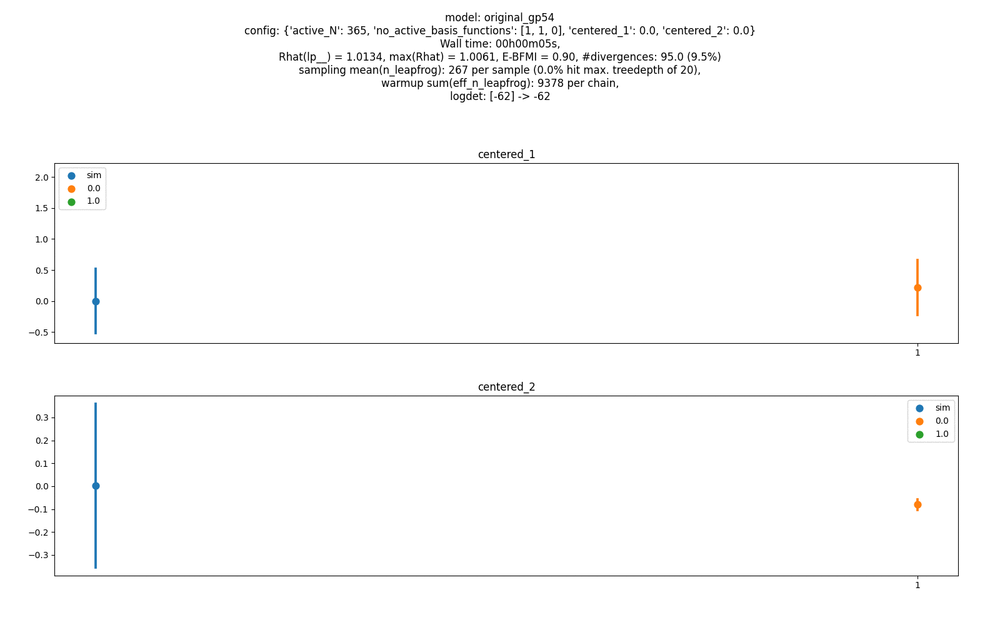

Somewhat surprisingly, only removing the intercept does not remove the run-time issues,
which puts us in a new situation. As the only thing that we added was the
weekday effect, it looks like something about the way we did this amplifies
the already existing problems and/or introduces new ones.

Let's apply all of the fixes from model 2 (no intercept, GP1(larger length-scale, lower SD)):

### Model 3: No intercept, GP1(larger length-scale, lower SD)


Comparing this plot with the same plot for model 2 reveals that the
weekday effect appears to introduce its own version of an intercept term!
Previously the slow GP started roughly at zero, but now it's slightly elevated.
Enforcing the weekday effects to sum to zero removes this "spurious" additional
intercept term, but does not appreciably affect the number of leapfrog steps needed:

### Model 3: No intercept, GP1(larger length-scale, lower SD), DOW sum-to-zero


Only removing the original intercept term and enforcing the weekday sum-to-zero constraints
does not appreciably improve intermediate predictive performance or the number of
needed leapfrog steps:


## Model 4 (slow+seasonal+varying day of the week)

Expecting even less than before,
let's see how the [fourth model](https://github.com/avehtari/casestudies/blob/master/Birthdays/gpbff.stan) fares with the default configuration, i.e. with
10 basis functions for the slow trend,
2x20 basis functions for the seasonal effect,
5 basis function for the varying weekday effect
and the following priors:
```stan
  intercept0 ~ normal(0, 1);
  beta_f1 ~ normal(0, 1);
  beta_f2 ~ normal(0, 1);
  beta_f3 ~ normal(0, 1);
  beta_g3 ~ normal(0, 1);
  lengthscale_f1 ~ lognormal(log(700), 1); //in days
  lengthscale_f2 ~ normal(0, .1); //in years
  lengthscale_g3 ~ lognormal(log(7000), 1); //in days
  sigma_f1 ~ normal(0, 1);
  sigma_f2 ~ normal(0, 1);
  sigma_g3 ~ normal(0, 0.1);
  sigma ~ normal(0, 0.5);
```

As for model 3, fitting takes an unacceptably long time (more than 10 minutes)
and is aborted early (any intermediate fit which
takes more than 500 leapfrog steps per iteration gets automatically flagged
for inspection, because this generally indicates
that little information from the previous fit carries over to the next fit,
which in turn in my very limited experience generally indicates some sort of misspecification).

Indeed, everything looks quite horrible.


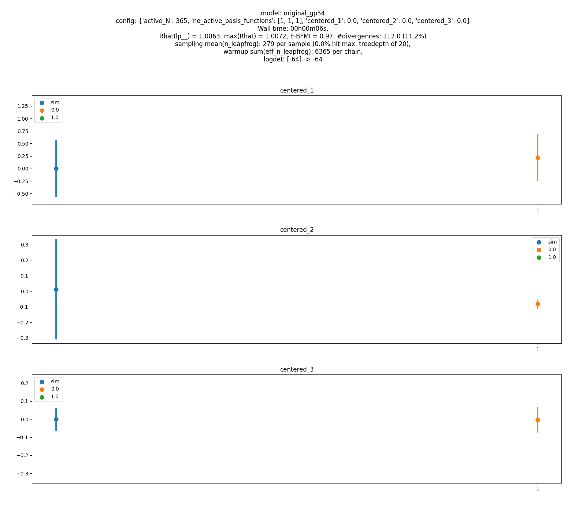

Adding all of our previous fixes fixes almost all of our problems:

### Model 4: No intercept, GP1(larger length-scale, lower SD), DOW sum-to-zero


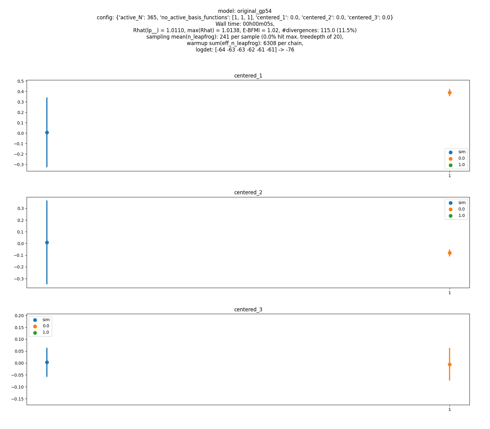

However, it looks like the third GP approximation has not converged, and something is
interfering with our ability to identify the weight of its first basis function.

The visualization of the correlations reveals to the eagle-eyed observer another bowtie
in the lower right corner (I should improve the tunability of this visualization):

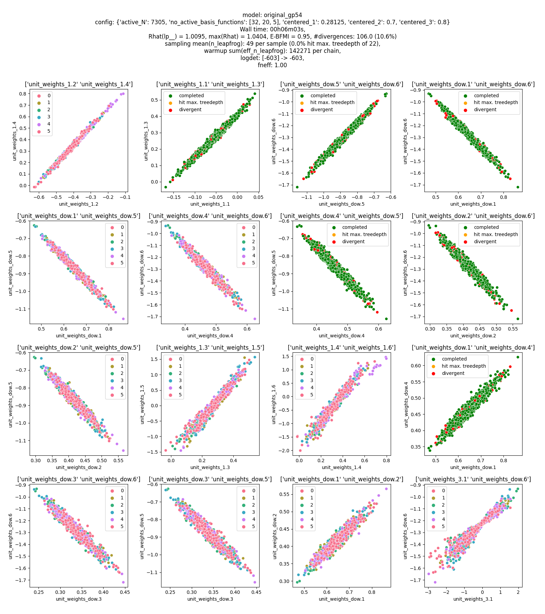

The weight of the first basis function of the third GP exhibits the same unholy
dependence on the weight of one of the weekday effects that we have seen before!

## A break

At this point we take a break for time reasons, although we're not yet done.
